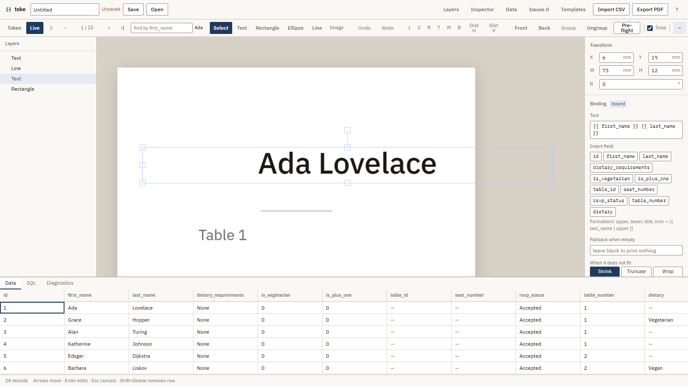

# toke

A variable data design studio that runs entirely in the browser. Bind canvas elements to a
relational dataset, preview any record live, impose the run onto print sheets, and export a
press-ready vector PDF.



## The problem

A wedding needs 150 place cards, identical except for the name on each one. Doing that properly
needs three things: a dataset, a design that references its columns, and an imposition that fits as
many cards onto a sheet as the paper allows. The tools that do all three are desktop applications
with a licence fee. The tools that are easy to reach are mail-merge, which cannot impose, and design
software, which cannot read a database.

toke does the whole run: CSV in, imposed press-ready PDF out, nothing uploaded anywhere.

## The workflow

**Import.** A CSV goes into SQLite, which is compiled to WebAssembly and runs in a worker. Column
types are inferred conservatively — `"007"` stays text, a column of `"1"` stays an integer rather
than becoming a boolean — because guessing wrong about a postcode is worse than asking.

**Bind.** A text object holds `{{ first_name }} {{ last_name }}` rather than a name. Tokens are
column references resolved against the current row, not queries; one query per design, not one per
token.

**Set the record source.** One query per design decides the print run — `WHERE rsvp_status =
'Accepted'` is the difference between printing a card for everyone invited and printing one for
everyone coming. Its rows *are* the run: one row, one card.

**Preview.** Live mode shows any record on the canvas. Cycle to the longest name in the list and
watch it shrink to fit rather than run past the trim.

**Impose.** Trim 85 × 55mm at 10-up on A4 with 3mm bleed, shared cut lines so neighbouring cards
butt on one cut, crop marks in the margins. The panel reports the yield — 22 records, 3 sheets, 8
cells wasted — from the same solver the PDF uses, so it cannot promise a yield the export will not
deliver.

**Pre-flight, then export.** A scan across every record, not just the one on screen: overflow,
unresolved tokens, missing values. Then a PDF with `TrimBox` and `BleedBox` on every sheet,
subset-embedded fonts and selectable vector text.

## How it is built

Three threads, and a hard rule for each boundary.

```
main thread                 db.worker.ts              pdf.worker.ts
───────────                 ────────────              ─────────────
React + Fabric canvas  ⇄    sql.js (SQLite WASM)      pdf-lib + fontkit
zustand stores              owns ALL SQL              plain scene graph
IndexedDB persistence       typed RPC envelope        + font bytes
```

**No SQL outside the database worker.** The UI calls typed RPC methods; the worker owns the handle.
Enforced by a test that greps the tree, because this is the rule that erodes the first time someone
wants "just one quick query" from a component.

**No Fabric objects cross a worker boundary.** Fabric instances are not structured-cloneable and
carry the whole canvas by reference, so the scene is serialised to a plain `SceneNode[]` first.

**One text-measurement path.** This is the interesting one.

### Why measurement is the whole problem

Auto-fit decides whether a name fits its box. If the canvas measures text one way and the PDF
renderer measures it another, auto-fit passes on screen and overflows in print — silently, across
an entire run, discovered when the cards come back from the press.

So there is exactly one measurement function. `engine/text/measure.ts` wraps fontkit and is the only
place text dimensions are computed; canvas auto-fit and PDF layout both call it. The browser is
handed the *same font bytes* through `FontFace` that fontkit parsed, so both sides read one file
rather than two copies that might differ.

A harness at `/dev/measure` puts the browser's own advance width beside fontkit's for 20 strings
across five sizes and every bundled face — 400 comparisons — and an end-to-end test fails the build
if any of them disagree by more than half a point.

`ctx.measureText` appears nowhere except inside that harness, and a test enforces it.

The same principle runs through the rest: the imposition solver that draws the sheet preview is the
one the exporter uses, and the crop geometry that positions an image on canvas is the function the
PDF renderer calls.

### The PDF renderer is hand-written

pdf-lib cannot import SVG or canvas output, so `SceneNode` → pdf-lib draw calls is written by hand.
That makes the renderer's feature set a hard product constraint rather than an implementation
detail — if the renderer cannot draw it, the canvas must not offer it.

Text is where this is most delicate. Positions come from the measurement path, alignment uses the
measured width rather than pdf-lib's own, and a missing font raises an error instead of
substituting one, because a substituted face changes every advance width on the page.

## Running it

```bash
npm install
npm run dev          # http://localhost:3000
```

Node 24. No environment variables are required — nothing in this project may hold a secret, since
every `NEXT_PUBLIC_` value is inlined into the browser bundle and there is no server to hold one.

There is no backend, no account and no upload. The dataset lives in a SQLite file in the tab, the
project saves to a `.toke` file on disk, and the PDF is generated in a worker.

## Tests

```bash
npm run typecheck
npm run lint
npm run test         # 712 unit tests
npm run test:pdf     # 55 golden tests against real PDF bytes
npm run test:e2e     # 125 Playwright tests
```

The engine is pure functions and tested close to exhaustively — unit conversions, the imposition
solver, the token parser and resolver, auto-fit, geometry.

The PDF suite renders fixtures, parses the bytes back and asserts on extracted page geometry, box
values and content-stream operators. It does not diff raw bytes: pdf-lib output is not stable across
runs, so a byte diff fails for reasons that have nothing to do with the rendering being correct.

The end-to-end suite includes the full acceptance run in one unbroken test — import 150 guests,
design a card, bind it, cycle to the name that does not fit, impose, pre-flight, export, then
inspect the resulting PDF for page count, box nesting, an embedded font subset and selectable text,
and finally save the project, reload the browser and reopen it.

`npm run verify` runs the first three. CI runs all of them plus a production build.

## Stack

Next.js 16 · React 19 · TypeScript · Fabric.js 6.9 · sql.js · pdf-lib + fontkit · zustand ·
Tailwind 4 · Biome · Vitest · Playwright

Everything internal is measured in points. Conversion happens at the edges — on input, on display,
and never in between — and the units are branded types, so a raw number reaching geometry is a
compile error rather than a millimetre silently treated as a point.

## Conventions

[CLAUDE.md](CLAUDE.md) is the source of truth for architecture, code style and the design system.
Work branches from `staging`, never from `main`; the branching model and release process are in
[scratch/DEVELOPMENT.md](scratch/DEVELOPMENT.md).

To regenerate the screenshot above after a UI change:

```bash
npx playwright test --config=scripts/screenshot.config.ts
```
